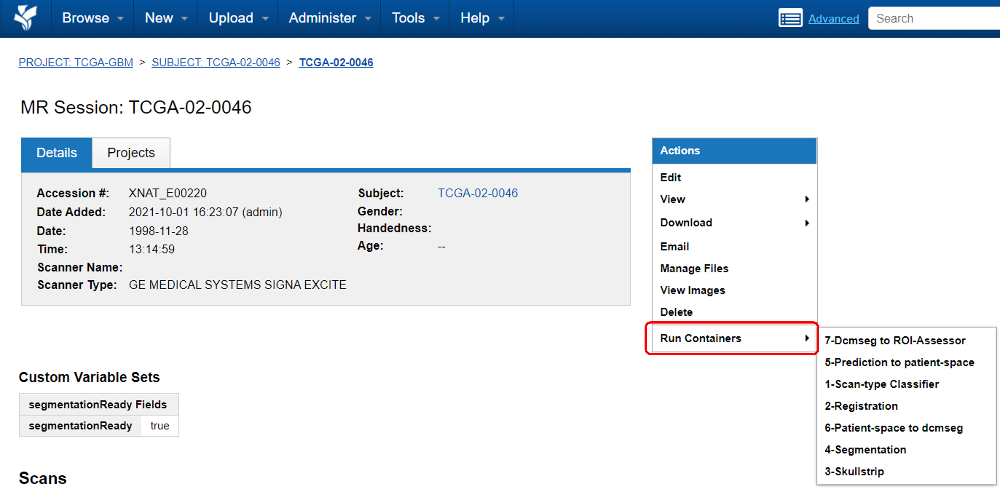

# Running on XNAT (preferred)
### 1. Installation and Requirements
!!!!!!!!! XNAT version
#### 1.1. XNAT setup
Please follow these steps to set up XNAT, import data, and enable container service:
1. [Set up XNAT](https://wiki.xnat.org/documentation/getting-started-with-xnat/xnat-installation-guide)
2. [Create a project](https://wiki.xnat.org/documentation/how-to-use-xnat/creating-and-managing-projects)
3. [Import data](https://wiki.xnat.org/documentation/how-to-use-xnat/image-session-upload-methods-in-xnat)
4. [Container service administration](https://wiki.xnat.org/container-service/container-service-administration-122978855.html)
#### 1.2. Pulling and enabling containers
Once container service is set up, [pull the following docker images](https://wiki.xnat.org/container-service/pulling-a-container-image-126156950.html) to XNAT:
* `satrajit2012/nrg_ai_neuroonco_preproc:v0`
* `satrajit2012/nrg_ai_neuroonco_segment:v0`
 
In order to launch containers, the corresponding container commands need to be first enabled at the site level (by a site admin) and then at the project-level (this can be done by a project owner). For details on how to enable commands, please check out the following links:
1. [Enabling commands at site-level](https://wiki.xnat.org/container-service/enabling-commands-and-setting-site-wide-defaults-126156956.html)
2. [Enabling commands at project-level](https://wiki.xnat.org/container-service/enable-a-command-in-your-project-122978909.html)

Now with everything set up, we are ready to run the containers.
### 2. Running containers
There are various ways we can run the containers:
* manually run multiple containers on single session
* manually run single container on multiple sessions (using XNAT's batch-mode feature)
* automatically run multiple containers on single session (using XNAT's command orchestration feature)
* automatically run multiple containers on multiple sessions (by combining XNAT's command orchestration with batch-launch feature)

In this section I describe the above 4 modes of running the containers.
#### 2.1. Manually run multiple containers on single session
In this step, you can launch containers through the "Run Containers" option from the XNAT UI. Note that, as these containers are defined at a session-level context (i.e. they run on each session independently, not on a subject or project level), the "Run Containers" menu should only appear within a session, as following:

Inside the "Run Containers" menu are all the different command wrappers that can be used to launch the different workflows on the session.  
For mo

Note:

First, a command must be added to your XNAT, and its wrapper must be enabled in your project. Then when you are on a page where a command and wrapper are available, a Run Containers menu will appear in the Actions box.
#### 2.2. Manually run single container on multiple sessions
#### 2.3. Automatically run multiple containers on single session
#### 2.4. Automatically run multiple containers on multiple sessions

